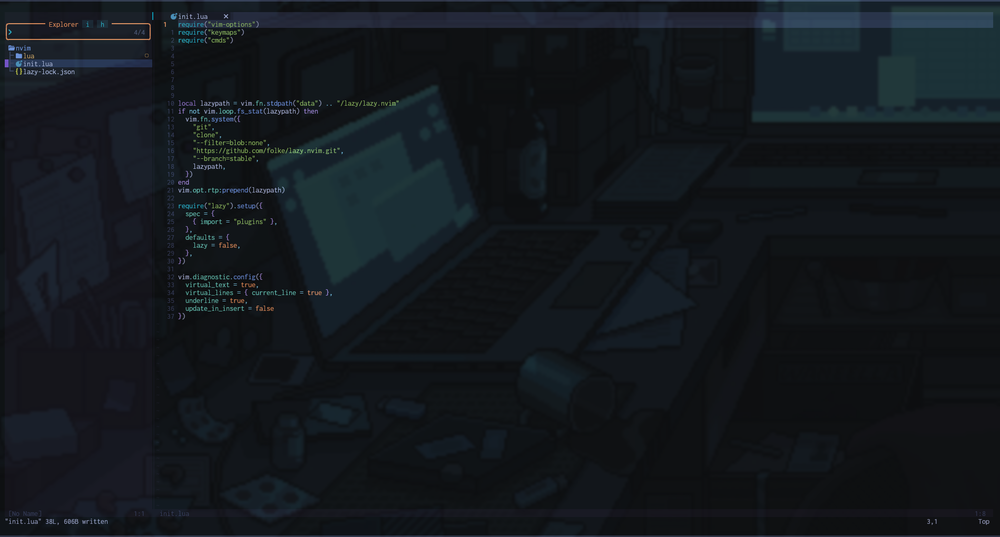

# NvimConfig
My Neovim Config
=======

# 🌌 My Custom Neovim Config (LazyVim)

> Minimal, clean and fully usable setup for daily development.



---

## ✨ About

This is my personal **custom Neovim configuration** that I use every day.
It is built on top of [LazyVim](https://lazyvim.github.io) and supports multiple languages:

* Python 🐍
* Go 🚀
* C/C++ ⚙️
* Rust 🦀


---

## 💡 Recommendations

For the best experience, I suggest using:

* [Kitty Terminal](https://sw.kovidgoyal.net/kitty/) with transparency
* Zsh with a Nerd Font (like JetBrainsMono Nerd Font)
* A dark/neon-style wallpaper

---

## 🔧 Dependencies

Make sure you have installed:

* Neovim 0.9+
* `git`, `curl`
* [Nerd Font](https://www.nerdfonts.com/) (optional but recommended)

---

## 🚀 Installation

```bash

# Install Lazy.nvim plugin manager
git clone https://github.com/folke/lazy.nvim ~/.local/share/nvim/lazy/lazy.nvim


# Clone this config
git clone https://github.com/MrPhoenix174/NvimConfig.git ~/Downloads

cd ~/Downloads/NvimConfig/nvim

# Copy files
cp -r ./* ~/.config/nvim/

nvim
```

When you open Neovim, Lazy.nvim will install all plugins automatically.


## 💬 Questions or Issues?

If something doesn’t work or you have suggestions, you can open issues.

Also, you can follow me on Telegram: [t.me/MrPhoenix_works](https://t.me/MrPhoenix_works)

Thanks for checking it out! ⭐
